# Weekly nerd
I have learned a lot during the minor webdevelopment, some things from working with Javascript mot most from working with HTML and CSS. Because I study software enginering and I already knew some things about coding I have chosen to focus this minor more on the creative classes. for this reason I want to write three articles about things I found most intresting of the things I have learned during this minor.

## Display attribute
### Display block 
The display attribute is a very handy css tool you can use to moddify the behavour of an element. Most of the common elements are a block element which means they have the same width as their parent width, and apear as a list under eachother with their siblings. Some examples of common block elements are: main, article, section, div, h1 and p.  

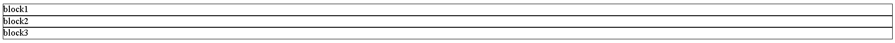  
Figure 1: Display block.

### Display inline
There are some exeptions, some elememts are not block elements, these are inline elements. This means that they are not 100% of their parent width and apear next to eachother. Some examples of common inline elements are: a, span, image, input, script and button.  

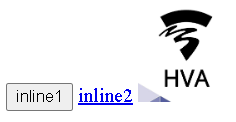  
Figure 2: Display inline.

Pro tip: You can also use the "display:inline-block" attribute, this is a combination between a block element and a inline element. It uses most of the propeties of an inline element but can just like a block element you can change the height and width propety of the element.

### Display none
The last classic display propety that I have used during this cource is the display none. Display none is pretty simple, it removes a element from the page compleetly like it did not existed at all. I used this a lot for switching between pages when a user presses a button. Be warned using display none uses a lot of resources from your browser because it has to redrawn the enteire page, as you can see in figure 1 and figure 3, the next elements after the removed element are moved upwards to the spot of the removed element. 

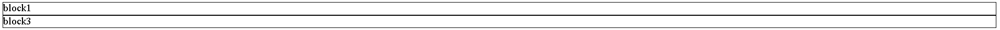  
Figure 3: Display none.

Pro tip: if you can affort it, it can somethimes better to use opacity: 0, because as you can see in figure 4, the entire page does not have te be redrawn. Opacity also works fantastic with transitions so you can do some cool things with it.

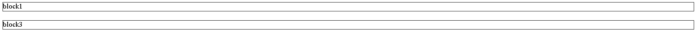  
Figure 3: Opacity 0.

### Display flex
Over the years new dipslay propeties have apreared, these propeties are not standard bound to some elements, but just as with display none, you have to assign this proppety to a element yourself. One of these propeties is the flexbox propety, a flexbox is a verry cool propety because it is initialy a block element. However, it changes the behaviour of its children so that they are all inline. Then you can customize the children even further with other flexbox propeties, you can center or put the children on the right side of the screen, you can even play with the space between the elements to create some thing great. With "flex-wrap: wrap" It is also possible to break the children if the child elements are bigger than your flexbox container (or your screen), this is cool because with this it is much easier to make parts of your website responseable.

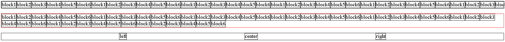  
Figure 4: Flexbox 0.

In figure four, I made three flexboxes, the first one is a regular flexbox with its children next to eachother with a some of its chilldren outside of the parent container. The second flexbox has the propety "flex-wrap: wrap" so its children are possisioned nicely after the screen is too small. The last flexbox has fewer children and has the propety "justify-content:space-evenly", this means that its children are kinda centred because all the space between the children and the parend are perfectly evenly devided.

### Display grid
The last display propety I would like to discuss is the grid, you can almost compare a grid with a flexbox, except that it is 2 dimensional instead of 1 demenisonal and you can declare a grid with the "display:grid" propety. A grid has rows and colomns, rows are the vertical children and columns are the horizontall children. A grid is really handy in my opinion because you can design your entire website with one big grid and if you need to swap children around you can use "grid-column-start" and "grid-row-start" to flip the designs of you website around.

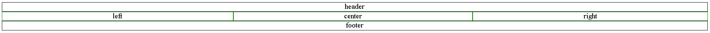  
Figure 5: Grid.

### Conclusion

### Sources
https://www.w3schools.com/html/html_blocks.asp
https://developer.mozilla.org/en-US/docs/Web/CSS/display
https://www.w3schools.com/css/css_inline-block.asp
https://css-tricks.com/snippets/css/a-guide-to-flexbox/
https://css-tricks.com/snippets/css/complete-guide-grid/
https://caniuse.com/

## Position atribute
### Position static
The second thing I would like to discuss is the position attribute, with the position attribute you can do some cool things. You can use this attribute to move elements from their original position, or align an element to the top, right, bottom, left and stick an element to the viewport. First of all I want to talk about the static position. The static possition is a possition that every element standart has. So this means that all elements are a static element so there is nothing special.

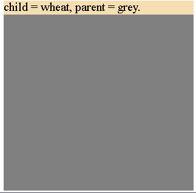  
Figure 6: Position static.

### Position relative
An element with position relatave propety is exactly the same as a static element, except that it reacts to the "top", "left", "bottom" and "right" propeties. Each of these propeties moves the element away from the selected propety, so "top:1px" moves the element downwards by 1px.

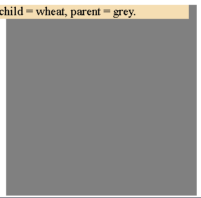  
Figure 6: The child element is moved 10 px to the left with the right propety.

### Position absolute
My favorite position, I used to use a grid for this but since I have learned about it I never stoped using it. An absolute element sticks to the first parent it can find with an other posiotion that static, then with the "top", "left", "bottom" and "right" propeties the absolute element sticks to the parent side of the selected propety. So "left:0" sticks the child element on the right side. This is not everything you can do, you can even increase the pixels so that it moves away from the parent side with that amound of pixels. This means you can do very cool things with it. What I like to do is making a parent element relative, and not changing the "top", "left", "bottom" and "right" propeties. Then I can make one of its child elements absolute and apply the "bottom: 0; right:0" propeties to it. Now you have a child element that has something in the bottom right of the parent element you could add something like an icon.

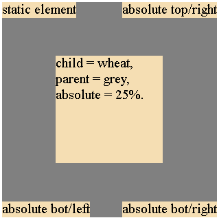  
Figure 7: Some amazing things you can do with the absolute propety.

### Position fixed
Position fixed works kinda the same a position absoulute, there is one difference though, a fixed element does not stick to the first relative element but to the viewport. This means you can make some cool things like a alert box or add a logo in the bottom left of the screen. This also means that if you scroll the element that is position fixed stayed in place because it is fixed to the viewport.

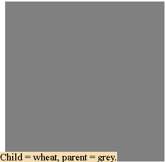  
Figure 8: Position fixed.

### Position sticky
Lastly you also have position sticky, possition sticky is a combination between position fixed and position relative. It starts as a normal element, but if you scroll past it it sticks to the viewport like a fixed element. This can be cool for things like menus.

### Conclusion

### Sources
https://developer.mozilla.org/en-US/docs/Learn/CSS/CSS_layout/Positioning

## CSS selectors
The last thing that I want to discuss are some css selectors. CSS selectors are pretty cool, before this minor I had some experience wit Jquery, I used classes where ever I could. But during the CSS to the resque cource I learned that you do not need those CSS classes, and can do a lot with only CSS selectors which I will soon tell you more about. During the master cource  I started working with components. This way I learned that if you split of your HTML, CSS and javascript in several components, you can give an id to that component, then you can use CSS selectors to the children of that component with the id to keep a clean css file. 

### :nth-child()
:nth-child() is a handy selector, you can use it to select one of the children of a parent. First you have to select a element, in figure 9 you can see that we have selected a div element. Then we need to declare the number of the child. So in this case we need the second child so the CSS would look like this: "div:nth-child(2)". You could even be more specific by targeting the ID of the component and the parent element like this: "#component>article>div:nth-child(2)".

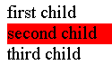  
Figure 9: the second child is selected with div:nth-child(2).

### :nth-of-type()
:nth-of-type() is something new I just learned today. It looks a lot like nth-child, but there is one difference. "div:nth-of-type(2)" selects the second div in the parent regardes of its possition. "div:nth-child(2)" also selects the second div but only if the second child of a parent is a div element. This is handy because you can add a compleet difrend child element to a parent later without destroying your css. It has to be anonther element or else it would not work.

  
Figure 10: An example of :nth-of-type() and :nth-child() (css-tricks.com)

### Conclusion

### Sources
